# ACCOUNT MANAGEMENT MODULE – ERP TUYỂN DỤNG

Tài liệu này tổng hợp và chuẩn hóa end-to-end logic nghiệp vụ cho **module quản lý tài khoản**, đối chiếu giữa đặc tả dự án và luồng/API đã được phân tích từ các hình ảnh UI/API trước đó. Mục tiêu là làm rõ: **tác nhân**, **use case**, **sequence**, **task**, **business rule**, **endpoint checklist**, và **phần cần bổ sung nếu hệ thống cũ chưa có**.

---

## 1) Phạm vi module

Module này quản lý toàn bộ vòng đời tài khoản và quyền truy cập:

- Đăng ký tài khoản
- Xác thực email
- Đăng nhập / refresh token / logout
- Quản lý profile cá nhân
- Admin quản lý tài khoản toàn hệ thống
- HR quản lý tài khoản nội bộ trong phạm vi công ty
- Phân quyền theo role + ownership
- Audit log và security controls

---

## 2) Actors

### 2.1 Actors chính

- **Guest**: người chưa đăng nhập.
- **Candidate / Ứng viên**: quản lý tài khoản cá nhân và CV.
- **HR**: người dùng thuộc công ty, có quyền trong phạm vi company.
- **HR Manager**: HR có quyền quản lý thành viên HR nội bộ.
- **Admin**: quản trị toàn hệ thống.
- **System**: các service nền như JWT, refresh token, email service, audit log, notification.

### 2.2 Mối quan hệ quyền

- **Admin**: full system scope.
- **HR**: company scope.
- **HR Manager**: company scope + quản trị HR member.
- **Candidate**: self scope.
- **Guest**: chỉ thao tác public auth.

---

## 3) Account domain model

```json
{
  "id": "uuid",
  "email": "string",
  "password_hash": "string",
  "role": "ADMIN | HR_MANAGER | HR | CANDIDATE",
  "status": "PENDING | ACTIVE | SUSPENDED | DELETED",
  "company_id": "uuid | null",
  "is_verified": true,
  "verified_at": "timestamp | null",
  "created_at": "timestamp",
  "updated_at": "timestamp",
  "last_login_at": "timestamp | null"
}
```

### 3.1 Ý nghĩa các field

- `status`: trạng thái vận hành của tài khoản.
- `role`: quyền nghiệp vụ chính.
- `company_id`: ràng buộc ownership cho HR/HR Manager.
- `is_verified`: tài khoản đã xác thực email hay chưa.
- `password_hash`: chỉ lưu hash, không lưu plain text.

---

## 4) State machine cho tài khoản

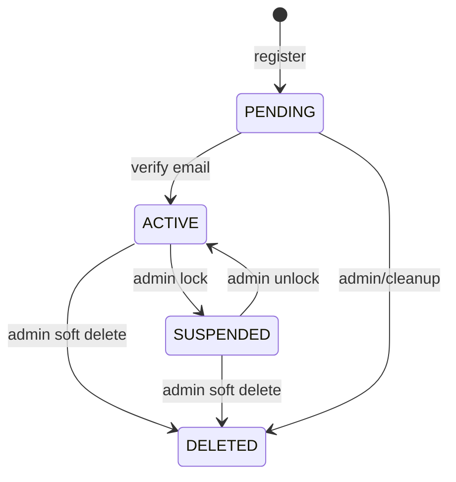

### 4.1 Business rules của state

- Tài khoản **PENDING** chưa được phép login nếu hệ thống yêu cầu verify email.
- Tài khoản **SUSPENDED** bị chặn toàn bộ thao tác xác thực.
- **DELETED** chỉ nên là soft delete để giữ lịch sử audit.
- **ACTIVE** là trạng thái duy nhất được phép truy cập nghiệp vụ bình thường.

---

## 5) Use case tổng quan

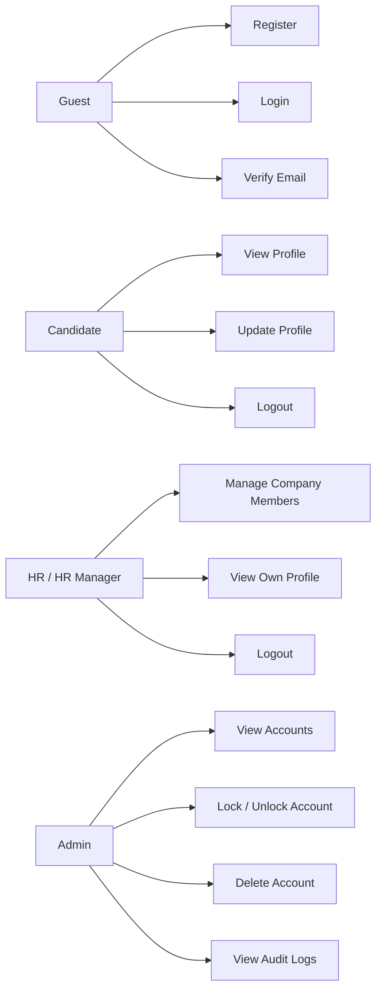

---

## 6) Task breakdown end-to-end

---

### TASK 1: Đăng ký tài khoản

#### Mục tiêu
Tạo tài khoản mới với trạng thái ban đầu là `PENDING`.

#### Actor
- Guest

#### Input
- email
- password
- role (nếu hệ thống cho phép chọn; nếu không thì mặc định Candidate)
- metadata tùy chọn: tên, số điện thoại, company code (nếu là HR flow)

#### Business flow
1. Validate format email/password.
2. Check email đã tồn tại hay chưa.
3. Hash password bằng bcrypt.
4. Tạo account với status `PENDING`.
5. Tạo verification token.
6. Gửi email xác thực.
7. Trả response thành công.

#### Sequence diagram
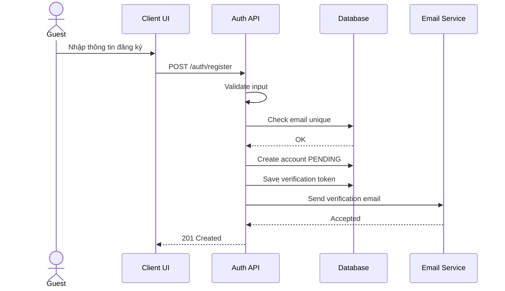

#### Endpoint checklist
- `POST /auth/register` — **có thể đã có**
- `POST /auth/resend-verification` — **thường thiếu, nên thêm**
- `POST /auth/verify-email` — **nên có nếu chưa có**

#### Nếu hệ thống cũ chưa có
- Thêm verification token table.
- Thêm job resend verification.
- Chặn login với tài khoản chưa verify.

#### Acceptance criteria
- Email trùng → reject.
- Password yếu → reject.
- Account mới tạo phải ở trạng thái PENDING.
- Có email xác thực gửi đi sau khi đăng ký.

---

### TASK 2: Xác thực email

#### Mục tiêu
Kích hoạt tài khoản từ `PENDING` sang `ACTIVE`.

#### Actor
- Guest / User nhận email

#### Flow
1. User bấm link verify.
2. API nhận token.
3. Validate token.
4. Kiểm tra token còn hạn.
5. Update account sang ACTIVE.
6. Ghi `verified_at`.
7. Hủy token.

#### Sequence diagram
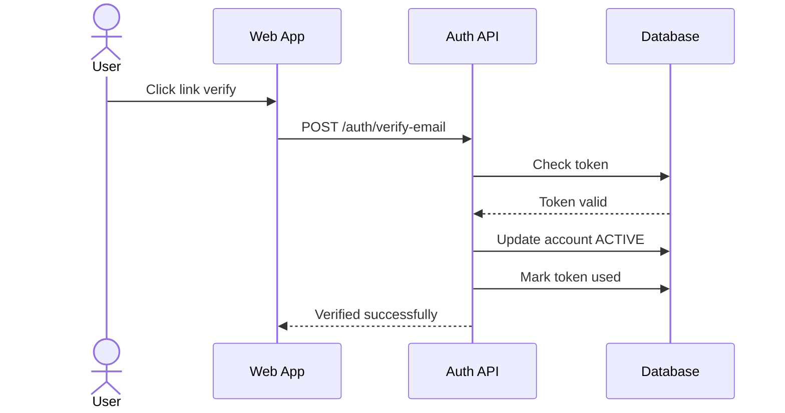

#### Business rules
- Token hết hạn sau 24 giờ.
- Token chỉ dùng một lần.
- Tài khoản chưa verify không được login nếu policy yêu cầu strict verification.

#### Endpoint checklist
- `POST /auth/verify-email` — **nếu chưa có thì phải thêm**
- `POST /auth/resend-verification` — **nên thêm**

---

### TASK 3: Đăng nhập

#### Mục tiêu
Xác thực user và cấp `access token` + `refresh token`.

#### Actor
- Guest / User

#### Flow
1. Nhập email + password.
2. Validate thông tin đăng nhập.
3. Tìm account theo email.
4. Check password hash.
5. Check status:
   - `ACTIVE` mới cho login
   - `SUSPENDED` hoặc `DELETED` phải từ chối
   - `PENDING` thì yêu cầu verify email
6. Phát hành JWT access token và refresh token.
7. Lưu refresh token hash hoặc session record.

#### Sequence diagram
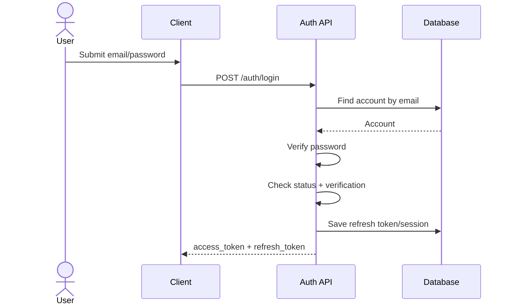

#### Endpoint checklist
- `POST /auth/login` — **có thể đã có**
- Nếu thiếu:
  - check `is_verified`
  - rate limit
  - lockout after repeated failures

#### Acceptance criteria
- Sai password → reject.
- Tài khoản bị khóa → reject.
- Tài khoản chưa verify → reject hoặc yêu cầu verify.
- Đăng nhập thành công phải ghi nhận `last_login_at`.

---

### TASK 4: Refresh token

#### Mục tiêu
Gia hạn access token mà không cần login lại.

#### Flow
1. Nhận refresh token.
2. Xác thực chữ ký/token tồn tại.
3. Check token chưa bị revoke.
4. Nếu hợp lệ thì cấp access token mới.
5. Có thể rotate refresh token để tăng bảo mật.

#### Sequence diagram
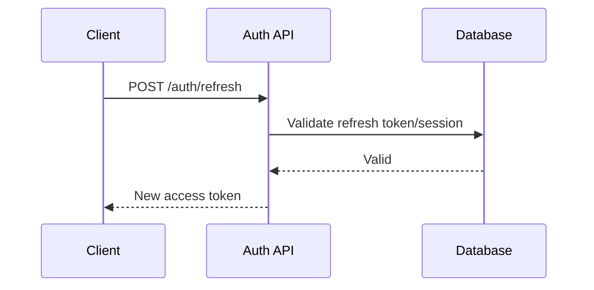

#### Endpoint checklist
- `POST /auth/refresh` — **có thể đã có**
- Cần bổ sung:
  - refresh token rotation
  - revoke old token khi logout

---

### TASK 5: Logout

#### Mục tiêu
Kết thúc session hiện tại.

#### Flow
1. Nhận refresh token hoặc session id.
2. Revoke token/session.
3. Xóa cache/token blacklist nếu có.
4. Trả response thành công.

#### Sequence diagram
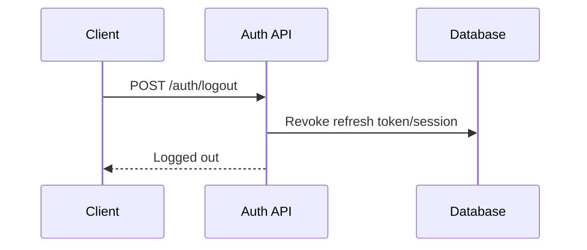

#### Endpoint checklist
- `POST /auth/logout` — **có thể đã có**
- Nếu hệ thống chưa có:
  - token blacklist
  - session table
  - logout all devices

---

### TASK 6: Xem profile của tôi

#### Mục tiêu
User đọc profile hiện tại.

#### Flow
1. Decode access token.
2. Lấy user id.
3. Trả thông tin profile.

#### Endpoint
- `GET /me` — **nên thêm nếu chưa có**

#### Acceptance criteria
- Chỉ trả dữ liệu của chính user.
- Không trả password hash, token, secret.

---

### TASK 7: Cập nhật profile của tôi

#### Mục tiêu
Cho phép user cập nhật thông tin cá nhân.

#### Flow
1. Authenticate.
2. Validate field cho phép cập nhật.
3. Update profile.
4. Ghi audit log.

#### Endpoint
- `PUT /me`
- `PATCH /me`

#### Nếu hệ thống cũ chưa có
- Thêm API update profile.
- Chỉ cho phép sửa các trường an toàn: tên, avatar, phone, address, current job title.

---

### TASK 8: Admin quản lý tài khoản toàn hệ thống

#### Mục tiêu
Admin có thể xem, khóa/mở khóa, xóa, thống kê tài khoản.

#### 8.1 Danh sách tài khoản
- `GET /admin/accounts`

##### Bổ sung nên có
- pagination
- filter theo role
- filter theo status
- search theo email
- sort theo created_at

#### 8.2 Khóa / mở khóa
- `PATCH /admin/accounts/:id/status`

##### Logic
- Nếu status = `SUSPENDED` → chặn login.
- Nếu status = `ACTIVE` → cho phép login trở lại.

#### 8.3 Xóa tài khoản
- `DELETE /admin/accounts/:id`

##### Rule
- Nên là soft delete để giữ audit và dữ liệu liên quan.

#### 8.4 Thống kê hệ thống
- `GET /admin/stats`

##### Nên bao gồm
- total users
- users by role
- active / suspended / pending
- đăng ký mới theo ngày

#### 8.5 Audit log
- `GET /admin/audit-logs` — **nên thêm**

##### Dùng để theo dõi
- ai khóa account
- ai thay đổi role
- ai xóa tài khoản
- login failures / suspicious events

#### Sequence diagram
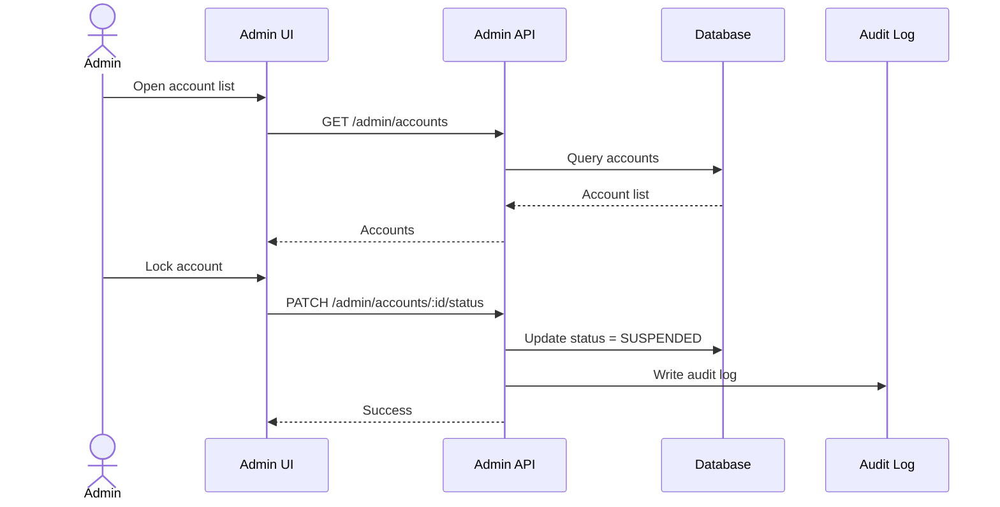

#### Endpoint checklist
- Có thể đã có:
  - `GET /admin/accounts`
  - `PATCH /admin/accounts/:id/status`
  - `DELETE /admin/accounts/:id`
  - `GET /admin/stats`
- Nên bổ sung:
  - `GET /admin/audit-logs`

---

### TASK 9: HR / HR Manager quản lý thành viên nội bộ

#### Mục tiêu
HR Manager thêm người vào team HR và quản lý quyền nội bộ trong phạm vi company.

#### Endpoints
- `GET /companies/:id/hr-members`
- `POST /companies/:id/hr-members`

#### Flow
1. Authenticate user.
2. Check role = HR Manager.
3. Check ownership: company của request phải khớp company của user.
4. Thêm member mới hoặc gán role HR.
5. Ghi audit log.

#### Sequence diagram
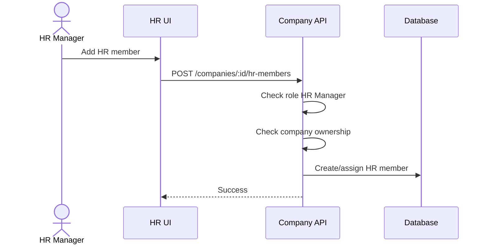

#### Business rules
- HR chỉ thao tác trong công ty của mình.
- HR Manager mới được thêm HR member.
- Không cho gán quyền vượt company scope.

---

### TASK 10: RBAC + Ownership enforcement

#### Mục tiêu
Bảo đảm người dùng chỉ truy cập đúng dữ liệu theo role và company.

#### Middleware logic
- `checkAuth`
- `checkRole`
- `checkOwnership`
- `checkStatus`

#### Pseudocode
```js
if (!user) throw Unauthorized;
if (user.status !== 'ACTIVE') throw Forbidden;

if (user.role === 'ADMIN') allowAll();

if (user.role === 'HR' || user.role === 'HR_MANAGER') {
  ensure(resource.company_id === user.company_id);
}

if (user.role === 'CANDIDATE') {
  ensure(resource.user_id === user.id);
}
```

#### Acceptance criteria
- HR không được xem dữ liệu công ty khác.
- Candidate không được sửa data của user khác.
- Admin có thể giám sát toàn hệ thống.
- Suspended account bị chặn mọi action.

---

## 7) Flow diagram theo vai trò

### 7.1 Admin flow

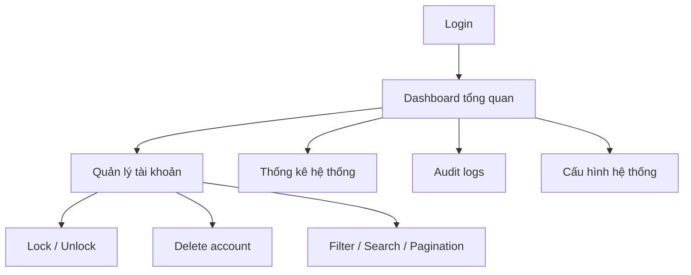

### 7.2 HR / HR Manager flow

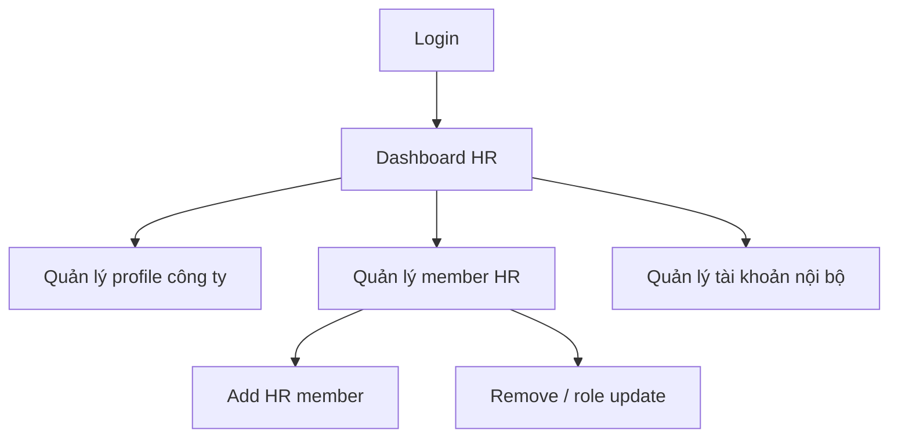

### 7.3 Candidate flow

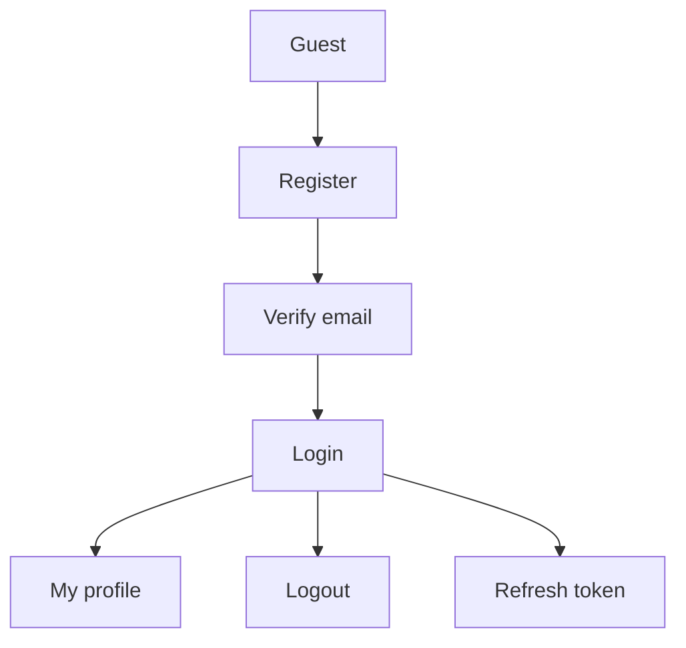

---

## 8) API inventory checklist

### 8.1 Auth
| Endpoint | Trạng thái | Ghi chú |
|---|---:|---|
| `POST /auth/register` | Có / cần xác minh | Cần token verify |
| `POST /auth/login` | Có / cần kiểm tra | Phải check status + verified |
| `POST /auth/refresh` | Có / cần hoàn thiện | Nên rotate token |
| `POST /auth/logout` | Có / cần hoàn thiện | Nên revoke session |
| `POST /auth/verify-email` | Có thể thiếu | Nên thêm nếu chưa có |
| `POST /auth/resend-verification` | Thiếu | Nên thêm |

### 8.2 Self-service
| Endpoint | Trạng thái | Ghi chú |
|---|---:|---|
| `GET /me` | Thiếu | Xem profile hiện tại |
| `PUT/PATCH /me` | Thiếu | Cập nhật profile |

### 8.3 Admin
| Endpoint | Trạng thái | Ghi chú |
|---|---:|---|
| `GET /admin/accounts` | Có | Nên thêm filter/pagination |
| `PATCH /admin/accounts/:id/status` | Có | Lock/unlock |
| `DELETE /admin/accounts/:id` | Có | Nên soft delete |
| `GET /admin/stats` | Có | Thống kê |
| `GET /admin/audit-logs` | Thiếu | Nên thêm |

### 8.4 HR / Company members
| Endpoint | Trạng thái | Ghi chú |
|---|---:|---|
| `GET /companies/:id/hr-members` | Có | Danh sách HR |
| `POST /companies/:id/hr-members` | Có | Thêm HR |
| `PATCH /companies/:id/hr-members/:id` | Thiếu | Sửa vai trò / quyền |
| `DELETE /companies/:id/hr-members/:id` | Thiếu | Xóa member khỏi team |

---

## 9) Nghiệp vụ kiểm tra “endpoint có chưa, thiếu thì xây thêm”

Đây là checklist triển khai theo đúng hệ thống cũ:

### Bước 1: Kiểm tra endpoint hiện có
- Đối chiếu swagger/postman/route file.
- Xác định endpoint nào đã có controller/service/repository.

### Bước 2: Kiểm tra thiếu logic trong endpoint có sẵn
Ví dụ endpoint có tồn tại nhưng thiếu:
- verify email
- token rotation
- ownership check
- pagination
- audit log

### Bước 3: Bổ sung theo pattern cũ
Khi endpoint thiếu, nên tái dùng kiến trúc đang có:
- controller
- service
- repository
- middleware
- DTO/validator
- entity/model

### Bước 4: Gắn rule bảo mật
- auth guard
- role guard
- ownership guard
- status guard
- rate limit

### Bước 5: Viết test
- unit test
- integration test
- permission test
- negative test

---

## 10) Business rules chuẩn hóa

1. Email phải duy nhất.
2. Password phải hash.
3. Tài khoản phải verify email trước khi login nếu policy bật strict verify.
4. Access token ngắn hạn.
5. Refresh token có thể rotate/revoke.
6. Admin có quyền toàn cục.
7. HR/HR Manager bị giới hạn theo company.
8. Candidate chỉ thao tác trên dữ liệu của chính mình.
9. Suspended account bị chặn toàn bộ nghiệp vụ.
10. Xóa tài khoản nên soft delete.
11. Mọi thao tác nhạy cảm phải ghi audit log.
12. Thao tác đổi role/khóa tài khoản phải có reason nếu hệ thống yêu cầu compliance.

---

## 11) Security requirements

- BCrypt/Argon2 cho password hash.
- JWT access token 15 phút.
- Refresh token 7 ngày hoặc theo policy.
- Revoke refresh token khi logout.
- Rate limit login.
- Protect against brute force.
- Validate input bằng schema validator.
- Không leak password hash / token / secret ở response.
- Ghi audit cho hành động admin và HR Manager.

---

## 12) Data tables đề xuất

### `accounts`
- id
- email
- password_hash
- role
- status
- company_id
- is_verified
- verified_at
- created_at
- updated_at
- deleted_at

### `refresh_tokens`
- id
- account_id
- token_hash
- expires_at
- revoked_at
- created_at

### `email_verification_tokens`
- id
- account_id
- token_hash
- expires_at
- used_at
- created_at

### `audit_logs`
- id
- actor_id
- action
- target_type
- target_id
- payload_json
- created_at

### `company_members`
- id
- company_id
- account_id
- member_role
- status
- created_at
- updated_at

---

## 13) Test checklist

### Positive tests
- Register thành công.
- Verify email thành công.
- Login thành công.
- Refresh token thành công.
- Logout thành công.
- Admin lock/unlock thành công.
- HR Manager thêm HR member thành công.

### Negative tests
- Email trùng.
- Password sai.
- Verify token hết hạn.
- Login khi chưa verify.
- Login khi suspended.
- Candidate gọi endpoint admin.
- HR truy cập company khác.
- Refresh token bị revoke.
- Xóa account nhưng vẫn login được.
- Duplicate member trong cùng company.

---

## 14) Suggested implementation order

### Phase 1
- Hoàn thiện auth core: register, verify, login, refresh, logout.

### Phase 2
- Bổ sung self-service: `/me`, update profile.

### Phase 3
- Hoàn thiện admin management: list, status, delete, stats, audit logs.

### Phase 4
- Hoàn thiện HR company members: add/remove/update role.

### Phase 5
- Hoàn thiện security hardening: rate limit, token rotation, audit, tests.

---

## 15) Kết luận

Module quản lý tài khoản cần được hiểu không chỉ là “đăng nhập/đăng ký”, mà là một hệ thống gồm:

- **state machine**
- **RBAC**
- **ownership**
- **token lifecycle**
- **audit**
- **security**
- **self-service**
- **admin governance**

Nếu triển khai đúng theo tài liệu này, module sẽ đủ để mở rộng sang các phần khác của hệ tuyển dụng như:
- quản lý company
- job posting
- application tracking
- notifications
- AI screening

---

## 16) Checklist cuối cùng trước khi code

- [ ] Đã có route cho auth đầy đủ
- [ ] Đã có verify email
- [ ] Đã có middleware role/ownership
- [ ] Đã có self-service `/me`
- [ ] Đã có admin account management
- [ ] Đã có HR member management
- [ ] Đã có audit log
- [ ] Đã có test cho các case deny/forbidden
- [ ] Đã có token blacklist / revoke
- [ ] Đã có pagination/filter/sort cho list endpoints
