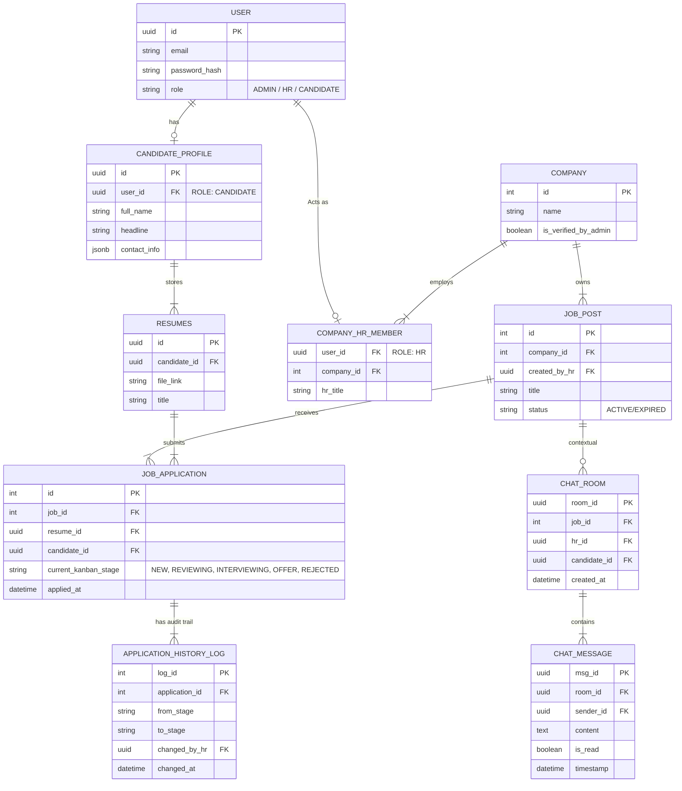
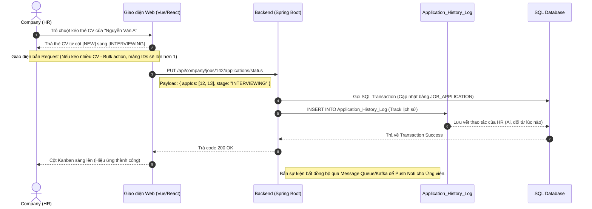
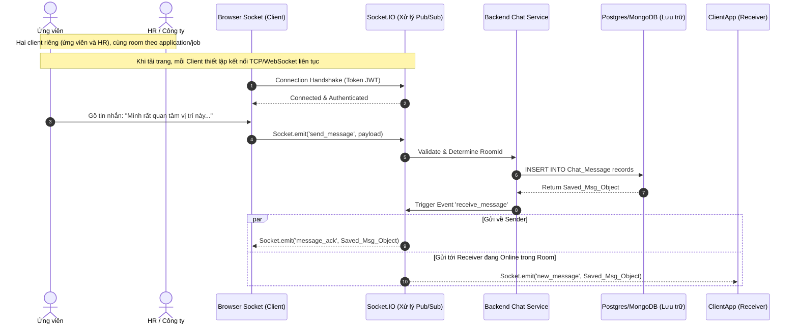

# TÀI LIỆU THIẾT KẾ KIẾN TRÚC & NGHIỆP VỤ: HỆ THỐNG TUYỂN DỤNG (BẢN CHUYÊN SÂU)

Tài liệu này được tái cấu trúc thành một System Specification Document chi tiết cho phân hệ ERP_HRM. Nó mô tả chuyên sâu cách quản lý Profile Ứng viên (Candidate), Phân quyền vận hành, Kiến trúc nhắn tin thời gian thực với Socket.IO và Hệ thống Kanban cho nhà tuyển dụng (Employer/HR). **Chat** trong hệ thống là kênh **ứng viên ↔ công ty (HR / người đại diện tin tuyển dụng)**, gắn với ngữ cảnh đơn ứng tuyển / job.

> [!IMPORTANT]
> **Tạm ngưng module AI:** Mọi module liên quan đến AI CV Scoring, Ranking đã được gỡ bỏ trong Scope tài liệu này để đảm bảo Framework cốt lõi (Base Flow) được vận hành ổn định trước.

> **Kế hoạch triển khai, unit test & manual test:** [docs/MASTER_PLAN_IMPLEMENTATION_QA.md](./docs/MASTER_PLAN_IMPLEMENTATION_QA.md)

---

## 1. Phân định Vai trò (Role Definition) & Quản lý Truy cập

Hệ thống được chia cắt thành 3 phân khu (Zone) ứng với 3 loại tài khoản chính:

### 1.1. System Admin (Quản trị Hệ thống Toàn cầu)
- **Role:** `ROLE_SYSADMIN`
- **Nhiệm vụ:** Không trực tiếp thao tác tuyển dụng. Quyền hạn bao gồm: Duyệt đăng ký doanh nghiệp mới (Tránh lừa đảo); Ban/Khóa tài khoản Công ty hoặc Ứng viên lạm dụng; Quản lý Master Data (Categories, Job Roles, Skills Dictionary).

### 1.2. Company Member / HR (Nhà tuyển dụng)
- **Role:** `ROLE_HR`
- **Nhiệm vụ:**
  - Định hình **Employer Branding** (Logo, Văn hóa công ty, Benefits).
  - Khởi tạo Job Posts.
  - Sở hữu không gian làm việc là **Kanban Board** để rà soát hàng ngàn CV đổ về, thực hiện Drag-Drop CV qua các vòng phỏng vấn (Cập nhật Status).
  - Tự do khởi tạo phiên Chat với Ứng viên để trao đổi.

### 1.3. Candidate (User thông thường / Ứng viên)
- **Role:** `ROLE_CANDIDATE`
- **Nhiệm vụ:** Quản trị Profile cá nhân, Upload/Tạo nhiều CV đa dạng, Tìm kiếm việc làm, Ứng tuyển và **Theo dõi chặt chẽ trạng thái CV** (Job Application Tracker). Ứng viên hoàn toàn có thể chủ động Direct Message (DM) cho HR phụ trách một Job cụ thể.

### 1.4. Ánh xạ vai trò: đặc tả ↔ codebase (Spring)

| Đặc tả tài liệu (Socket.IO / SYSADMIN) | Code hiện tại (`rules.md`, JWT, STOMP) | Ghi chú |
|----------------------------------------|----------------------------------------|---------|
| `ROLE_SYSADMIN` | `ADMIN` | Quản trị user hệ thống; chưa tách bảng “duyệt công ty” — xem Epic G trong [MASTER_PLAN_IMPLEMENTATION_QA.md](./docs/MASTER_PLAN_IMPLEMENTATION_QA.md). |
| `ROLE_HR` | `HR`, `COMPANY` | `COMPANY` ≈ HR Manager / chủ sở hữu workspace; cùng phạm vi công ty (`companyId`). |
| `ROLE_CANDIDATE` | `CANDIDATE` | Khớp. |

---

## 2. Kiến trúc Profile Ứng Viên (Candidate Ecosystem)

Tham khảo từ cấu trúc của LinkedIn và ITviec, một Profile ứng viên chuẩn không chỉ là "1 tờ giấy A4", mà là một Cấu trúc Dữ liệu đa chiều (Multi-dimensional Profile).

1. **Core Identity (Định danh):** Avatar, Họ Tên, Headline (Tóm tắt bản thân - Nơi chứa từ khóa cực mạnh cho Search), Contact Info (SĐT ẩn/hiện, Email).
2. **CV Repository (Kho chứa CV):** Ứng viên upload hoặc Generate ra nhiều file PDF (Ví dụ: 1 CVI apply cho Front-end, 1 CVI apply cho Backend). 
3. **Application Tracker (Dashboard Ứng tuyển):** Cấu trúc UI dành riêng cho Candidate. Hiển thị dạng thẻ list các Job đã nộp đơn. Kèm theo "Tiến trình" (Timeline/Stepper):
   - 🕒 *Applied* (Đã nộp)
   - 👁️ *Viewed by HR* (HR đã mở xem CV)
   - 📞 *Phone Screening* (Đang đánh giá vòng sơ loại)
   - 🤝 *Interviewing* (Hẹn lịch phỏng vấn)
   - 🛑 *Rejected* / 💼 *Offered*.

---

## 3. Bản thiết kế Cơ sở dữ liệu Liên kết (ERD) Mở rộng

Sơ đồ đã được bổ sung kết nối tới Module `Socket.IO` (ChatRooms) và hệ thống `Audit_Tracker` (Lịch sử Kanban).

---

## 4. Sequence Diagram: Kanban Board & Pipeline Workflow

Phân hệ dành riêng cho HR. Màn hình Kanban (với các cột cố định `NEW` -> `REVIEWING` -> `INTERVIEWING` -> `HIRED/REJECTED`). Cho phép Drag & Drop (1 item hoặc Bulk).

---

## 5. Sequence Diagram: Tương tác Thời gian thực (Chat 2 chiều — Ứng viên ↔ HR / công ty)

> **Triển khai thực tế trong repo:** WebSocket dùng **STOMP qua SockJS** (`/ws/hrm`), broker prefix `/topic`, JWT gửi trong header `Authorization` lúc STOMP `CONNECT`. Sự kiện realtime (chat, Kanban) publish tới `/topic/applications/{applicationId}` và `/topic/jobs/{jobId}`. Diagram dưới đây vẫn minh họa luồng **Socket.IO** mang tính khái niệm; chi tiết kỹ thuật bám `rules.md` + [MASTER_PLAN_IMPLEMENTATION_QA.md](./docs/MASTER_PLAN_IMPLEMENTATION_QA.md) (Epic F).

Mô hình chat **một-đối-một theo phía nghiệp vụ tuyển dụng:** **Ứng viên** trao đổi với **HR (hoặc người đại diện công ty / Job owner)** trong phạm vi một đơn ứng tuyển — không phải chat nội bộ giữa các nhân viên HR với nhau. Luồng mở: cả hai phía đều có thể chủ động nhắn trước.

---

## 6. Góc phân tích: CÓ THỂ ÁP DỤNG `n8n` VÀO ĐÂY ĐƯỢC KHÔNG?

**Câu trả lời là CÓ.** Rất phù hợp - đặc biệt là vì hệ thống này tập trung nhiều thao tác lặp đi lặp lại của bộ phận Hành chính Nhân sự. `n8n` là một công cụ Workflow Automation (Giống Zapier) có thể cắm trực tiếp vào Backend của bạn qua các `Webhooks`.

### Ví dụ các Use Case "Ăn tiền" nhất khi kết hợp ERP_HRM + n8n:

1. **Auto Notification qua Slack/Zalo / Teams:**
   - **Thao tác trên Hệ thống:** Một Ứng viên (Senior Dev) vừa Nộp CV (Apply) vào Job quan trọng.
   - **Tích hợp n8n:** Backend của bạn không cần lập trình lằng nhằng Zalo API/Slack API. Bạn chỉ việc viết Code Post một JSON rỗng tới `n8n Webhook URL`. n8n sẽ đón JSON đó, và tự động gọi API tới Channel Slack của Ban Giám đốc: *"Có 1 Senior Dev cực kỳ xịn sò vừa nộp đơn vào Job xyz, mau vào check!"*.
2. **Kịch bản Email Marketing thông minh (Lead Nurturing):**
   - **Thao tác trên Hệ thống:** HR dùng tính năng Kanban (Bulk action), kéo thả 5 CV từ cột [NEW] sang [REJECTED]. Backend Spring Boot tiến hành update database.
   - **Tích hợp n8n:** Backend gọi n8n Webhook. Từ đó `n8n` móc nối tới các dịch vụ như Mailchimp, SendGrid. Nó không gửi Email báo rớt cục súc, mà nó gửi một Email được cấu hình: *"Cảm ơn bạn, hiện chưa phù hợp. Chúng tôi xin gửi tài liệu/ebook hướng dẫn phỏng vấn IT cho lần sau"*.
3. **Phỏng vấn tự động hóa:**
   - Khi HR thả thẻ CV vào cột `[INTERVIEWING]`, webhook gửi sang n8n -> n8n tích hợp với **Google Calendar** -> Tự động sinh ra 1 File Lịch họp Teams/Meet trống -> Gửi Email gắn link meeting kèm hướng dẫn test online đến ứng viên. HR không cần tự dán link thủ công nữa.

> [!TIP]
> Việc sử dụng `n8n` cho phần "Hậu kỳ" (Post-Action) giúp Backend (Spring Boot/Node) cực kỳ nhẹ. Backend chỉ lo ghi Database, Audit log. Gọi ngoại vi, gửi tin nhắn, đặt lịch, push data tới CRM... thì "đá" trách nhiệm cho một workflow n8n Node lo!
