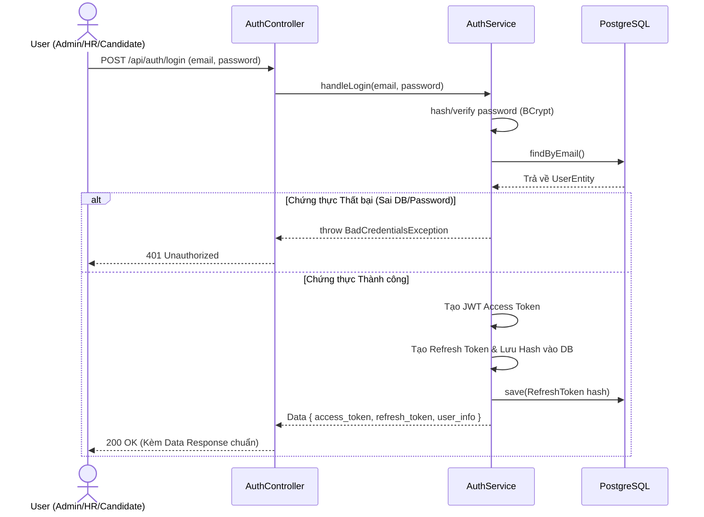
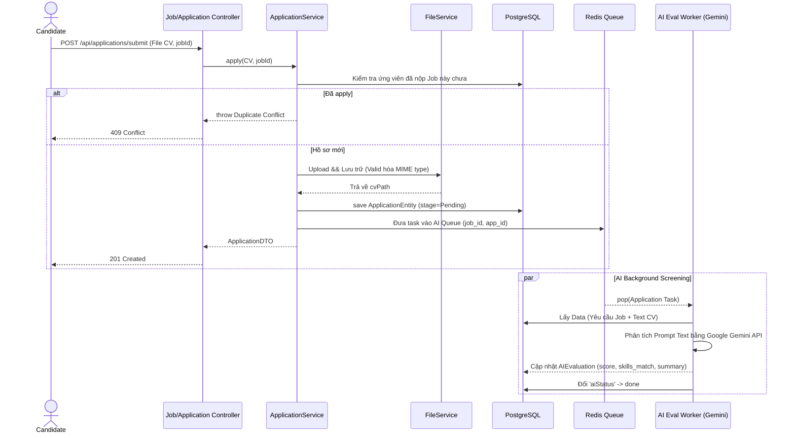
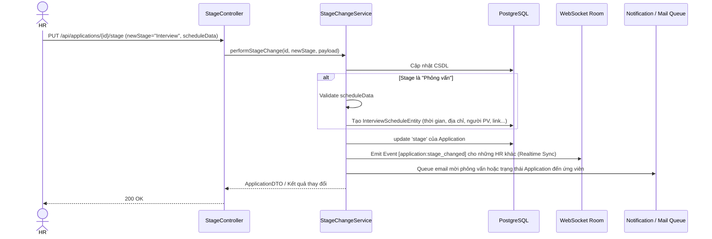
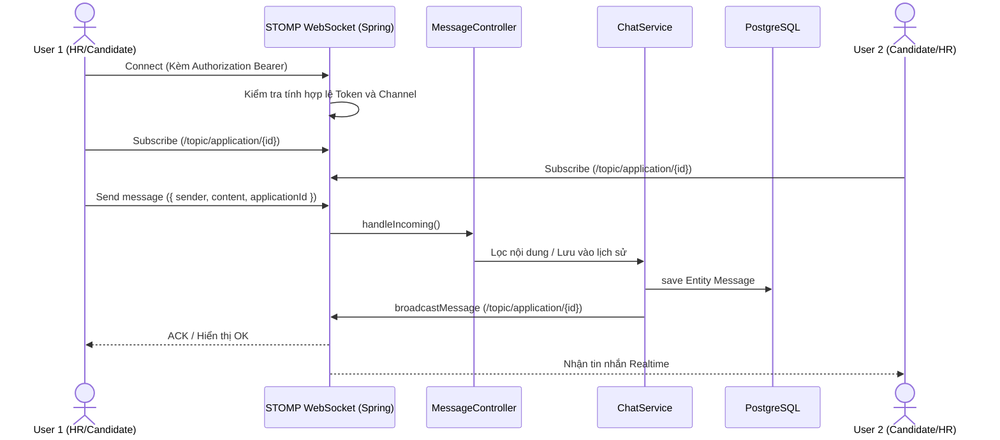
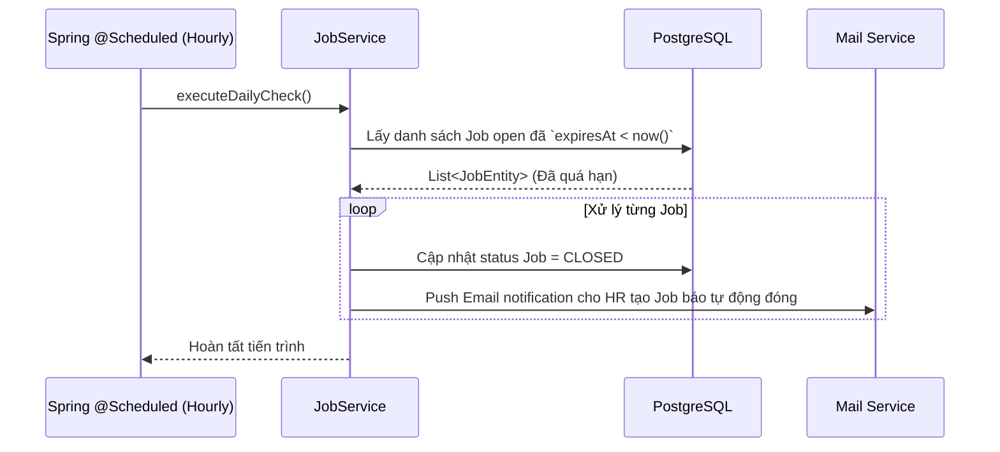

# Tài liệu Thiết kế Hệ thống - ERP HRM v2.0
Dựa trên yêu cầu của dự án (trong `task.md` và `rules.md`), dưới đây là các mô hình Use Case và Sequence Diagram cho từng chức năng chính của hệ thống.

## 1. Tác nhân hệ thống (Actors)
- **Candidate (Ứng viên):** Người tìm việc, xem danh sách công việc, nộp hồ sơ, xem trạng thái ứng tuyển và chat với HR.
- **HR (Nhân sự):** Người quản lý tin tuyển dụng, xem hồ sơ ứng tuyển, kéo thả trạng thái trên Kanban, lên lịch phỏng vấn, chat và phỏng vấn ứng viên.
- **Admin (Quản trị viên):** Người quản trị hệ thống, quản lý tài khoản, xem các báo cáo phân tích thống kê (Analytics).
- **System / AI (Hệ thống tự động):** Các tiến trình ngầm như Worker gọi Gemini API để chấm điểm CV ứng viên, Cronjob tự động phân tích và đóng Job đã hết hạn.

---

## 2. Mô hình Use Case (Tổng hợp)

```mermaid
usecaseDiagram
    actor Candidate
    actor HR
    actor Admin
    actor System
    
    package "Core & Auth" {
        usecase "Đăng ký tài khoản" as UC1
        usecase "Đăng nhập" as UC2
    }
    
    package "Job Management" {
        usecase "Xem danh sách Job (Public)" as UC3
        usecase "Quản lý Job (Tạo/Sửa/Xuất bản/Đóng/Xóa)" as UC4
    }
    
    package "Application Flow" {
        usecase "Ứng tuyển / Upload CV" as UC5
        usecase "Quản lý Ứng viên (Kanban Board)" as UC6
        usecase "Lên lịch phỏng vấn" as UC7
        usecase "Đánh giá CV bằng AI (Gemini)" as UC8
        usecase "Theo dõi tiến trình Ứng tuyển" as UC9
    }
    
    package "Communication & Notify" {
        usecase "Nhắn tin thời gian thực với HR/Candidate" as UC10
        usecase "Gửi Email Thông báo" as UC11
    }
    
    package "Analytics & System" {
        usecase "Xem báo cáo thống kê chuyên sâu" as UC12
        usecase "Đóng Job tự động sau khi hết hạn" as UC13
    }
    
    Candidate --> UC1
    Candidate --> UC2
    Candidate --> UC3
    Candidate --> UC5
    Candidate --> UC9
    Candidate --> UC10
    
    HR --> UC2
    HR --> UC4
    HR --> UC6
    HR --> UC7
    HR --> UC10
    
    Admin --> UC2
    Admin --> UC4
    Admin --> UC12
    
    System --> UC8
    System --> UC11
    System --> UC13
    
    UC5 .> UC8 : <<include>> (Tự động chuyển vào AI Queue sau nộp đơn)
    UC6 .> UC7 : <<extend>> (Chuyển stage sang "Phỏng vấn" bắt buộc lên lịch)
    UC6 .> UC11 : <<include>> (Đổi stage sẽ gửi email)
```

---

## 3. Sequence Diagram (Thiết kế luồng từng chức năng)

### 3.1. Chức năng Xác thực - Login / Token (Auth Service)



### 3.2. Quản lý Tin tuyển dụng & Nộp Hồ sơ (Apply CV) có tích hợp AI



### 3.3. Các thao tác Nhân sự (Kanban, Đổi Trạng thái & Xếp Lịch Phỏng vấn)



### 3.4. Hệ thống Realtime Chat & Message (In-App Chat)



### 3.5. Tiến trình tự động / Cronjob Quản lý Job




